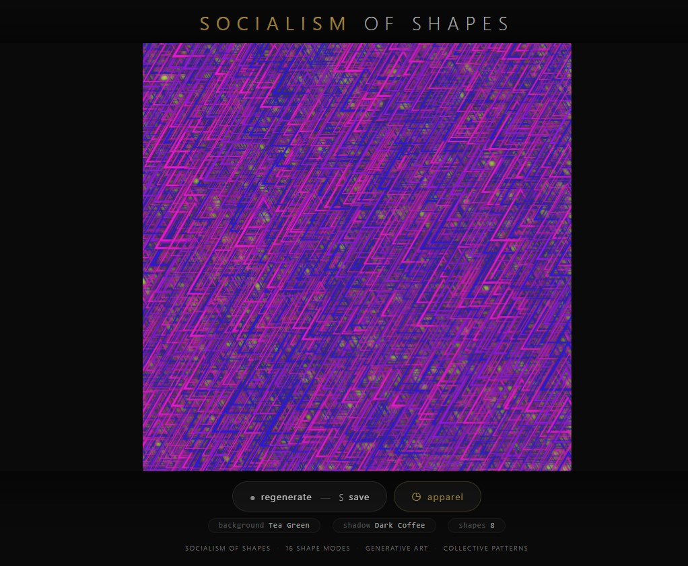
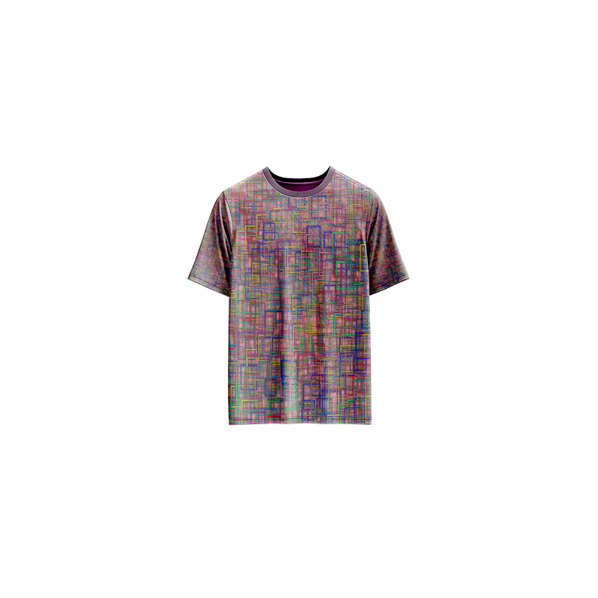

# Socialism of Shapes — Generative Art

[](https://reyrove.github.io/Socialism-of-Shapes-Generative-Art)
[](https://opensource.org/licenses/MIT)

> **Generative shape art with 16 unique pattern modes.** Each refresh creates a collective arrangement of shapes, lines, and geometric forms across a grid, exploring the harmony of diverse elements working together.

## 🎨 Live Demo

<div align="center">
  <a href="https://reyrove.github.io/Socialism-of-Shapes-Generative-Art" target="_blank">
    
  </a>
  <br><br>
  <a href="https://reyrove.github.io/Socialism-of-Shapes-Generative-Art" target="_blank">
    
  </a>
  <br>
  <em>Click the image or button to experience the generative art</em>
</div>

## 👕 Apparel Preview

<div align="center">
  
  <br>
  <em>Socialism of Shapes artwork printed on a T-shirt</em>
</div>

## ✨ Features

- **16 Shape Modes** — Lines, circles, arcs, triangles, squares, rectangles, and combinations
- **22 Background Colors** — Soft, pastel, and vibrant backgrounds
- **23 Shadow Colors** — Dark, moody shadow palettes
- **44 Foreground Palettes** — Multi-color combinations (2-8 colors)
- **Organic Grid** — Random spacing and sizing creates unique patterns
- **Glow Effects** — Subtle shadows create depth and dimension
- **Save & Share** — Download as PNG
- **Apparel Mode** — Preview artwork on a T-shirt mockup
- **Responsive** — Works on desktop, tablet, and mobile
- **Pure JavaScript** — Built without external libraries
- **Keyboard Shortcuts**:
  - `R` — Regenerate
  - `S` — Save image
  - `T` — Toggle apparel view
  - `Space` — Regenerate

## 🎨 Artwork Details

| Parameter | Range | Description |
|-----------|-------|-------------|
| **Shape Modes** | 16 options | Lines, circles, triangles, squares, rectangles, arcs, combinations |
| **Background Colors** | 22 options | Soft pastels and vibrant tones |
| **Shadow Colors** | 23 options | Dark, rich shadow palettes |
| **Foreground Palettes** | 44 options | 2-8 color combinations |
| **Grid Spacing** | Variable | Random spacing between shapes |
| **Shape Size** | Variable | Random size variation |
| **Stroke Width** | Variable | Random line thickness |
| **Shadow Blur** | Variable | Random glow intensity |

## 🎯 Shape Modes

| Mode | Description |
|------|-------------|
| **0 — Diagonal Lines** | Crossing diagonal line patterns |
| **1 — Full Circles** | Complete circles with varying sizes |
| **2 — Arc Segments** | Partial circle arcs with random angles |
| **3 — Offset Circles** | Circles with random offsets |
| **4 — Rotated Triangles** | Triangles with random rotation |
| **5 — Floating Triangles** | Triangles with random position offset |
| **6 — Rotated Triangles (90°)** | Triangles at 90° rotation |
| **7 — Rotated Triangles (180°)** | Triangles at 180° rotation |
| **8 — Rotated Triangles (270°)** | Triangles at 270° rotation |
| **9 — Rotated Squares** | Squares with random rotation |
| **10 — Aligned Squares** | Squares without rotation |
| **11 — Angled Squares** | Squares at 45° rotation |
| **12 — Mixed Shapes** | Random shape combinations |
| **13 — Mixed Shapes (Rotated)** | Random shapes with rotation |
| **14 — Variable Rectangles** | Rectangles with random proportions |
| **15 — Scaled Rectangles** | Rectangles with random scaling |

## 🚀 Quick Start

### Local Development

```bash
# Clone the repository
git clone https://github.com/reyrove/Socialism-of-Shapes-Generative-Art.git

# Navigate to the directory
cd Socialism-of-Shapes-Generative-Art

# Open in browser
open index.html
# or use a live server
```

### Deploy to GitHub Pages

1. Push to GitHub
2. Go to Settings → Pages
3. Select branch `main` and root folder
4. Your site will be live at `https://reyrove.github.io/Socialism-of-Shapes-Generative-Art`

## 🧠 How It Works

The artwork generates collective patterns of shapes working together in harmony:

1. **Setup**:
   - Random background color from 22 options
   - Random shadow color from 23 options
   - Random foreground palette from 44 options (2-8 colors)
   - Random shape mode from 16 options

2. **Grid Generation**:
   - Random spacing between shapes
   - Random shape size
   - Shapes positioned across the canvas
   - Each shape gets random properties

3. **Shape Rendering**:
   - Shapes drawn with random stroke colors from the palette
   - Random stroke width for variety
   - Shadow glow effect for depth
   - Each shape mode has unique behavior

4. **Collective Pattern**:
   - All shapes work together as a collective
   - Variations create organic, non-repeating patterns
   - The "socialism" concept: diverse elements in harmony

## 📁 File Structure

```
Socialism-of-Shapes-Generative-Art/
├── index.html          # Main application (all-in-one)
├── Socialism-of-Shapes.jpg # T-shirt mockup image
├── fav.svg             # Favicon
├── demo-screenshot.jpg # Website demo screenshot
├── README.md           # This file
└── LICENSE             # MIT License
```

## 🛠️ Tech Stack

- **Pure JavaScript** — No external libraries
- **Canvas API** — 2D rendering with shadow effects
- **CSS Flexbox/Grid** — Responsive layout
- **GitHub Pages** — Hosting

## 🎯 Interactive Controls

| Action | Keyboard | Button |
|--------|----------|--------|
| Regenerate | `R` or `Space` | Click "regenerate" |
| Save Image | `S` | Click "regenerate" |
| Toggle Apparel | `T` | Click "apparel" |

## 🎨 The Creative Process

### Collective Harmony
The artwork explores the concept of "socialism" through shapes—different geometric forms working together in harmony. Each shape maintains its individuality while contributing to a collective whole.

### Shape Diversity
With 16 shape modes, each composition explores a different geometric language. From simple lines to complex mixed shapes, the variety creates endless possibilities.

### Color Democracy
44 foreground palettes ensure each shape gets a fair share of color. The random distribution of colors across the grid creates a democratic, egalitarian pattern.

### Shadow and Depth
Carefully chosen shadow colors add depth and dimension to the shapes, making them feel tangible and three-dimensional despite being 2D.

## 📱 Responsive Design

The application automatically adapts to:
- Desktop screens
- Tablets
- Mobile phones
- Landscape orientation
- Various aspect ratios
- Small screens (down to 380px wide)

## 🤝 Contributing

Contributions are welcome! Feel free to:
- Fork the repository
- Create a feature branch
- Submit a pull request

### Ideas for Contributions:
- Additional shape modes
- New color palettes
- Animation features
- Interactive controls
- Performance optimizations
- More apparel mockups

## 📄 License

MIT License — see [LICENSE](LICENSE) file for details.

## 🙏 Acknowledgments

- Inspired by collective art movements and geometric harmony
- Named for the democratic arrangement of diverse shapes
- Special thanks to the creative coding community

---

**Built with ❤️ and collective dreams**